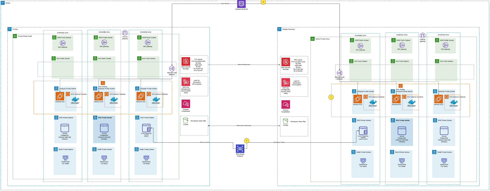

# Terraform Enterprise HVD Setup

This repository provides Terraform configurations to deploy Terraform Enterprise (TFE) using the HashiCorp Validated Design (HVD) module. It supports single-region (primary only) and multi-region (primary + DR) deployments, with a documented DR failover procedure.



## Repo layout

- `primary/` - Primary region TFE deployment using the HVD module.
- `dr/` - DR region TFE deployment configured as the Aurora Global Database replica. Includes optional VPC creation for demo purposes.
- `failover/` - Combined Terraform workspace that updates Cloudflare DNS and triggers Aurora Global Database failover/switchover.
- `README.md` - This guide.

## Configure TFE for single-region

Use the `primary/` directory only.

1) Copy and edit the variables file:

```powershell
Copy-Item primary/terraform.tfvars.example primary/terraform.tfvars
```

2) Update `primary/terraform.tfvars` with your values:
- `region`
- `vpc_id`, `lb_subnet_ids`, `ec2_subnet_ids`, `rds_subnet_ids`, `redis_subnet_ids`
- `tfe_fqdn`, secrets ARNs, and sizing settings
- `create_route53_tfe_dns_record` (set `false` if using Cloudflare)

3) Apply:

```powershell
cd primary
terraform init
terraform apply
```

The primary outputs include `tfe_urls.tfe_lb_dns_name`, which you can use for DNS in Cloudflare.

## Configure TFE for multi-region (primary + DR)

Deploy primary first, then DR.

### Primary

Follow the single-region steps above and apply in `primary/`.

### DR

1) Copy and edit the variables file:

```powershell
Copy-Item dr/terraform.tfvars.example dr/terraform.tfvars
```

2) Update `dr/terraform.tfvars` with your DR region values. In `dr/main.tf`, set the Aurora Global Database replication inputs (these are required for the secondary region):
- `rds_global_cluster_id` (from primary output)
- `rds_source_region` (primary region)
- `rds_replication_source_identifier` (primary RDS cluster ARN)
- `rds_kms_key_arn` (KMS key in DR region replicated from primary)

3) Apply in `dr/`:

```powershell
cd dr
terraform init
terraform apply
```

The DR outputs include `tfe_urls.tfe_lb_dns_name` for DNS failover.

## Failover module

Use the `failover/` directory to manage the Cloudflare DNS alias and trigger Aurora Global Database failover/switchover. The module wraps the AWS CLI using a `null_resource` and `local-exec`, so the AWS CLI must be available in the Terraform execution environment with valid AWS credentials.

1) Copy and edit the variables file:

```powershell
Copy-Item failover/terraform.tfvars.example failover/terraform.tfvars
```

2) Update `failover/terraform.tfvars`:
- `cloudflare_api_token`
- `cloudflare_zone_id`
- `active_region` (`primary` or `dr`)
- `action` and `run_id` (optional, used to control the RDS API call and force re-run)
- `global_cluster_identifier` and `target_db_cluster_identifier` are optional overrides; by default they are pulled from the primary/DR remote state outputs.

3) If you need a different DNS name, update `name` in `failover/main.tf`.

4) Apply:

```powershell
cd failover
terraform init
terraform apply
```

Switching DNS during failover/failback is done by changing `active_region` and re-applying.

Example to fail over DNS to DR:

```powershell
cd failover
terraform apply -var "active_region=dr"
```

## DR failover: primary to DR

Follow the sequence below during a regional failover.

1) Bring the DR ASG to 1:

```powershell
cd dr
terraform apply -var "asg_instance_count=1"
```

2) Fail over Aurora Global Database to DR using the `failover/` workspace:

```powershell
cd failover
terraform apply -var "action=failover-global-cluster" -var "active_region=dr" -var "run_id=2025-01-01T00:00:00Z"
```

You can get the identifiers from `primary/outputs.tf` and `dr/outputs.tf` via `terraform output -json`.

3) The same apply updates Cloudflare DNS to point to the DR NLB via `active_region=dr`.

Optionally, scale down the primary ASG after failover:

```powershell
cd primary
terraform apply -var "asg_instance_count=0"
```

## DR failback: DR to primary

Use this sequence once the primary region is healthy again.

1) Bring the primary ASG back to 1:

```powershell
cd primary
terraform apply -var "asg_instance_count=1"
```

2) Switch the Aurora Global Database back to primary using the `failover/` workspace:

```powershell
cd failover
terraform apply -var "action=switchover-global-cluster" -var "active_region=primary" -var "run_id=2025-01-01T00:00:00Z"
```

3) The same apply updates Cloudflare DNS back to the primary NLB via `active_region=primary`.

Optionally, scale down the DR ASG after failback:

```powershell
cd dr
terraform apply -var "asg_instance_count=0"
```

